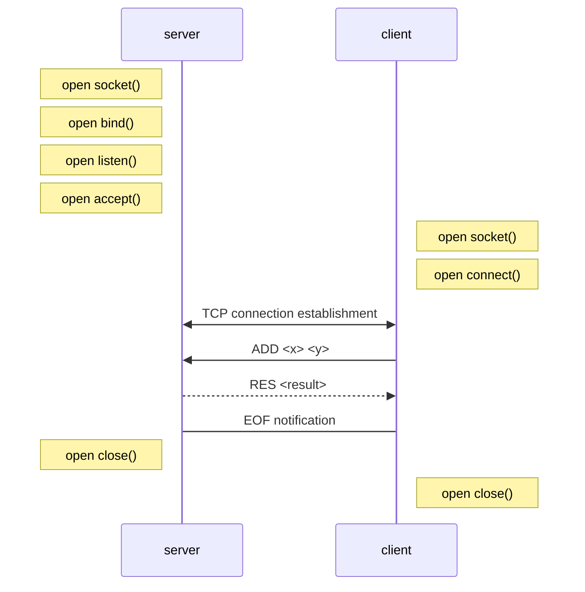
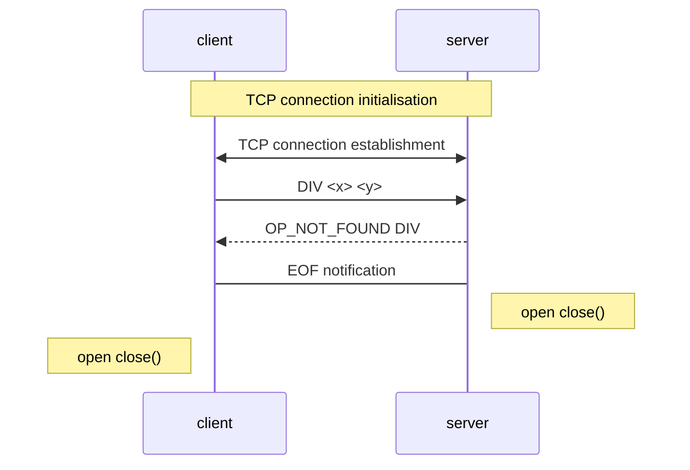

# Protocol specs
## Section 1 overview
The aim of this protocol is to implement basic mathematic operations (addition and multiplication) on a client-server model.

## Section 2 transport layer protocol
`MOP` (Math Operation Protocol) uses TCP. The client establishes the connection. It has to know the IP address
of the server. The server listens on TCP port `42012`.
The server closes the connection when the requested operation result or the error message has
been sent.

## Section 3 messages
There are four types of messages:

### Addition
```
ADD <x> <y>
```
### Multiplication
```
MUL <x> <y>
```

### Error
If the client requests to execute an invalid operation the server sends an error response message:
```
OP_NOT_FOUND <OP>
```

If the client request an `OP` with invalid values, the client sends an error response message:
```
INVALID_VALUES <x> <y>
```
Both messages are UTF-8 encoded with “\n” as end-of-line character.
If the operation exists, the server sends the result of the operation as binary byte stream.

### Result
```
RES <result>
```
The result of the operation is sent as a binary byte stream.

## Example dialog


### Example Error Dialog
