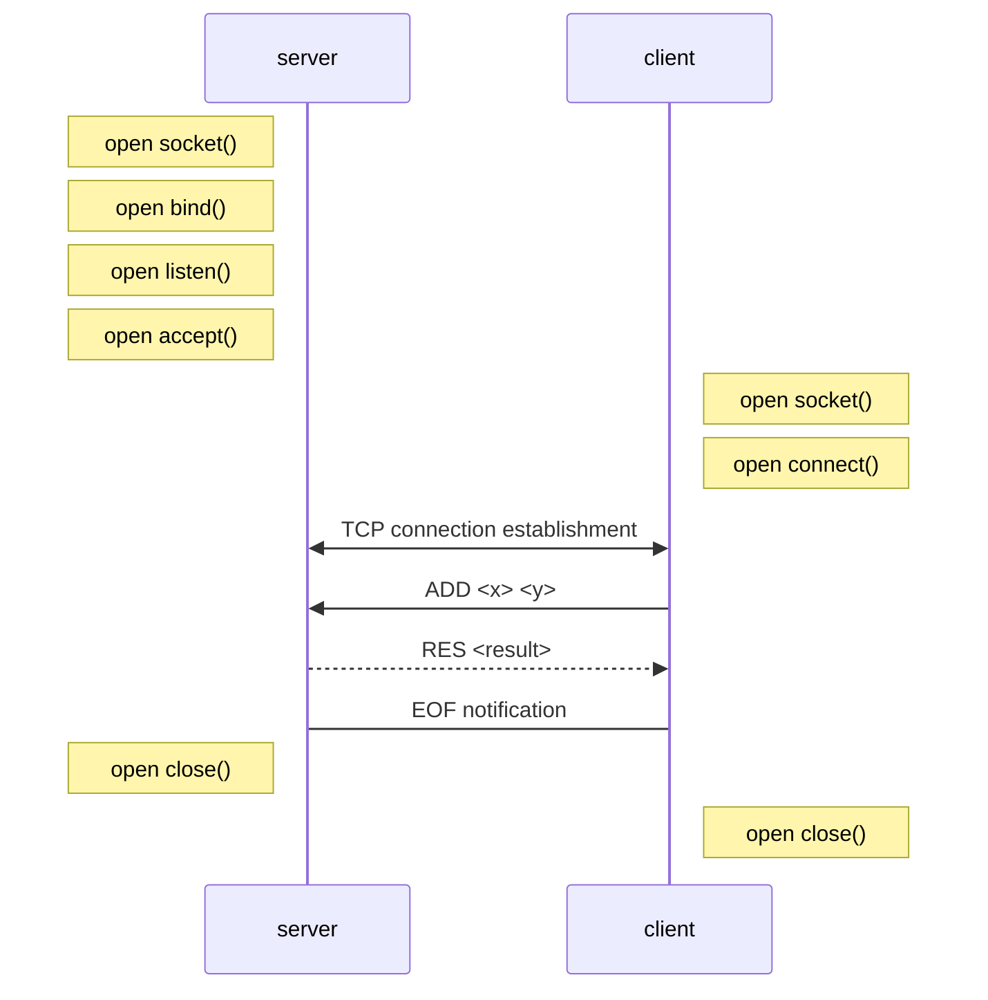

# Protocol specs
## Section 1 overview
The goal of this project is to implement a client-server application where the client can ask the server for the resulting answer of the given operation for example : Addition (ADD), Multiplication (MUL), ...
In case of a bad input this error must be handled and a exmple of usage must be given with the accessibles commands as for the "Introduction". 

## Section 2 transport layer protocol
TCP will be used. The client establishes the connection. It has to know the IP address
of the server.
The server closes the connection when the requested file or the error message has
been sent.

## Section 3 messages
There are four type of commands:

```
<OPP> <value1> <value2>
```
The client requests the result for a given operation <OPP> (ADD,MUL,...). The given result is sent to the client.

```
RES <value>
```
Response message after requesting <OPP> <value1> <value2>.
```
UNKNOWN_OPP <OPP> 
```
Error response message after a Operation request <OPP> non existent is requested 
```
UNKNOWN <value1> <value2>
```
Error response message after a Operation request <OPP> where the values given are non supported/incomplete

## Example dialog

