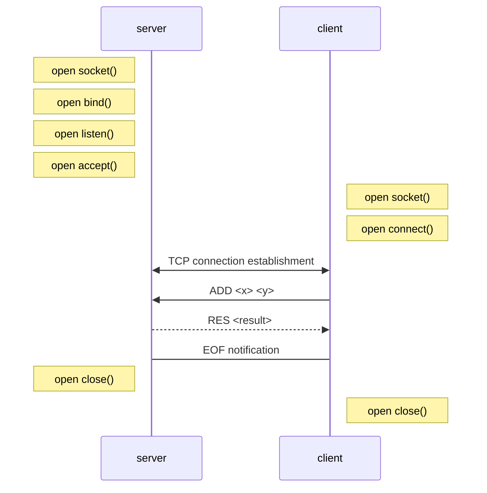

# Protocol specs
## Section 1 overview
The aim of this protocol is to implement basic mathematic operations (addition and multiplication) on a client-server model.

## Section 2 transport layer protocol
`protocol name` uses TCP. The client establishes the connection. It has to know the IP address
of the server. The server listens on TCP port `port`.
The server closes the connection when the requested operation result or the error message has
been sent.

## Section 3 messages
There are three types of messages:
### Addition
```
ADD <x> <y>
```
### Multiplication
```
MUL <x> <y>
```

### Error
The client requests to execute an operation. `x` and `y`
```
OP_NOT_FOUND <OP>
```
Error response message after an ADD message, if the operation does not exist.
Both messages are UTF-8 encoded with “\n” as end-of-line character.
If the operation exists, the server sends the result of the operation as binary byte stream.

## Example dialog
